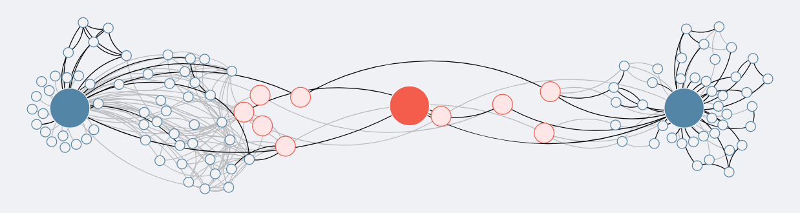

---
# Feel free to add content and custom Front Matter to this file.
# To modify the layout, see https://jekyllrb.com/docs/themes/#overriding-theme-defaults

layout: home
---

This seminar will introduce the digital humanities as a community of practice, a growing interdisciplinary field, and a set of approaches to research and teaching. Students in this course will explore a wide range of arguments and techniques, spanning such topics as critical code studies, technology in the classroom, digital editions, text and network analysis, machine learning, and data visualization. We will mix seminar discussion with hands-on activities designed to invite students to participate in DH's expanding community and to interrogate the methods, aims, and boundaries of digital scholarship in the twenty-first century.

## Learning Goals

During this quarter, you will:

- build a collective, multifaceted definition of the digital humanities out of the current debates and concerns in the field
- learn to think about humanities scholarship with/as data
- review current digital projects and explore a range of computational skills
- critique contemporary discourses of the digital humanities and of technology in general
- take first steps toward a digital project that fits into your current research
